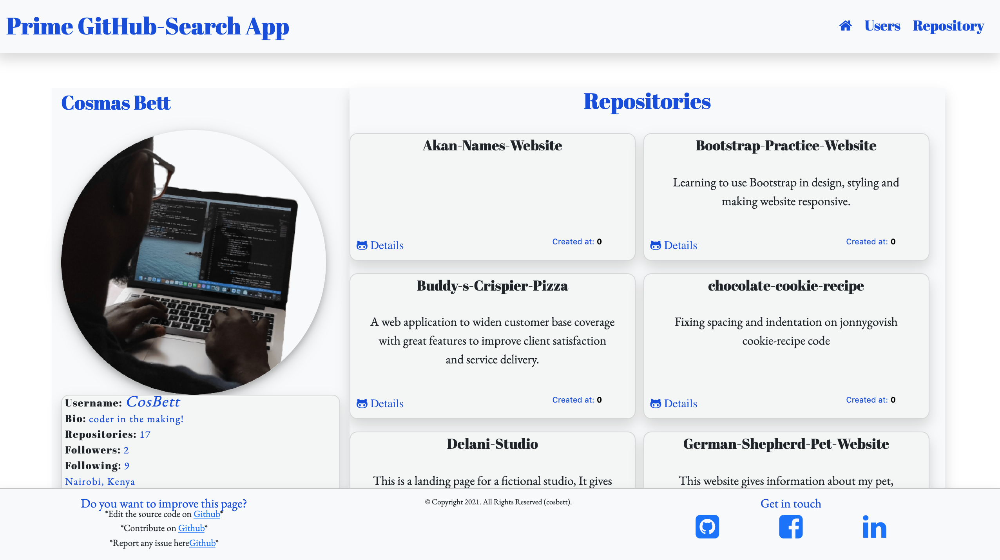

# Prime- GitHub- Search

<a href="https://cosbett.github.io/Prime-GitHub-Search/" > Live Demo link</a> 

## Description
#### 
This is a Website where GitHub users may enter a GitHub username into a form, submit it, and see names and descriptions of that person's public repositories. A person can also search for repositories.

#### By **Cosmas Bett**
#### latest update **17th Jan 2022**

### landing Page

### User search page

### Repository search page

#### 
This is a Website where GitHub users may enter a GitHub username into a form, submit it, and see names and descriptions of that person's public repositories. A person can also search for repositories.

### How to Clone this application,
 1. Open the terminal
 2. Paste this <strong> git clone https://github.com/CosBett/Prime-GitHub-Search-App.git </strong>
3. Open and edit with a code editor of your preference.

### Usage Instruction
1. Open your browser (preferably google chrome and active internet connection is required.) and paste the link below; https://cosbett.github.io/Prime-GitHub-Search/
 or <a href="hhttps://cosbett.github.io/Prime-GitHub-Search/" > Click here</a> to acess the 
2. Depending on your needs you can easily maneuver around the page.
3. The page provides well label buttons to make usage easily understandable and interative.

### Installation
This is a web application and there is no need to worry about installing it . This web application depends on GitHub for infomation fetch.

## Known Bugs
The application has no known bugs at the moment.

## Technologies Used
1. Typescript- application functionality.
2. Boostrap -for framework and overall web page responsiveness.
3. Javascript - Connect mail chimp API and track users responses through email and form on the web page.
4. AngularJs - Give the page contents a good UI/UX and make frontend interactive
5. CSS- for extra page styling. 

## Support and contact details

Incase of any issues or clarification, development, ideas, concerns or contributions to the code.  Kindly reach out through my email cosmasbett9@gmail.com.
## License

* Copyright 2021 Cosmas Bett

Permission is hereby granted, free of charge, to any person obtaining a copy of this software and associated documentation files (the "Software"), to deal in the Software without restriction, including without limitation the rights to use, copy, modify, merge, publish, distribute, sublicense, and/or sell copies of the Software, and to permit persons to whom the Software is furnished to do so, subject to the following conditions:
The above copyright notice and this permission notice shall be included in all copies or substantial portions of the Software.
THE SOFTWARE IS PROVIDED "AS IS", WITHOUT WARRANTY OF ANY KIND, EXPRESS OR IMPLIED, INCLUDING BUT NOT LIMITED TO THE WARRANTIES OF MERCHANTABILITY, FITNESS FOR A PARTICULAR PURPOSE AND NONINFRINGEMENT. IN NO EVENT SHALL THE AUTHORS OR COPYRIGHT HOLDERS BE LIABLE FOR ANY CLAIM, DAMAGES OR OTHER LIABILITY, WHETHER IN AN ACTION OF CONTRACT, TORT OR OTHERWISE, ARISING FROM, OUT OF OR IN CONNECTION WITH THE SOFTWARE OR THE USE OR OTHER DEALINGS IN THE SOFTWARE.
*
Copyright (c) 2021 **Cosmas Bett**
  